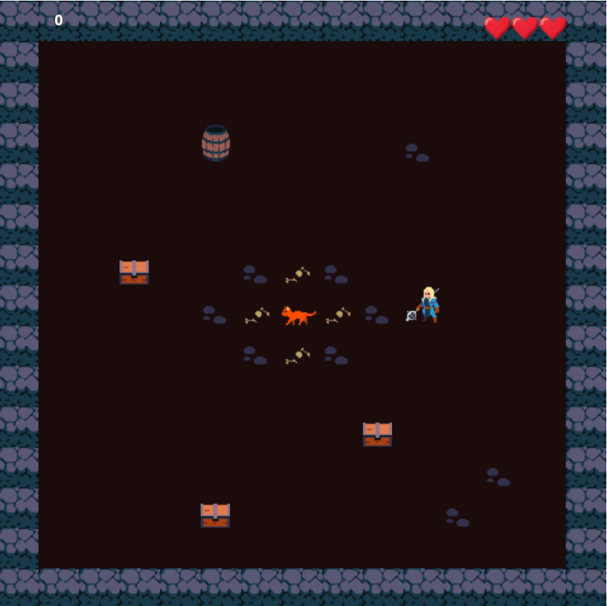
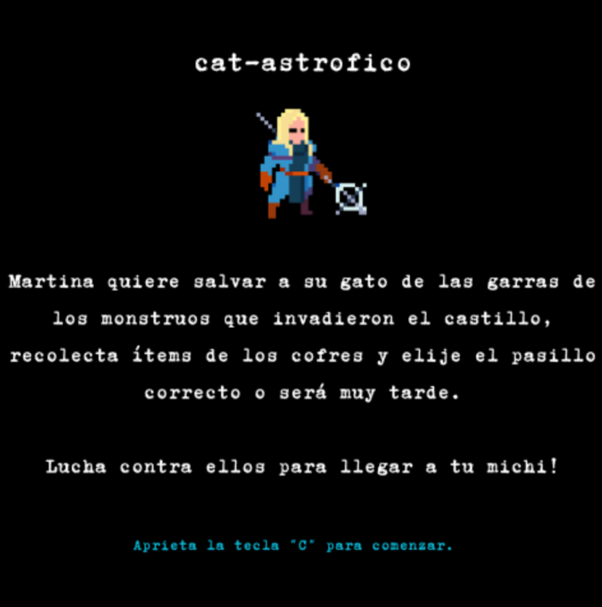

# Cat-astrofico

## Equipo de desarrollo

- Daniela Del Carmen Mendez 
- Maria Fidelia Gorosito Lopez  
- Martiniano Oliveto 

## Capturas

## Reglas de Juego / Instrucciones
Martina tiene un problema. Su amado gato, Michi, se ha extraviado y la búsqueda la ha llevado al lugar más improbable y peligroso: la entrada de la infame Mazmorra de la Sombra.

El tiempo se agota. Se rumorea que la mazmorra solo se traga a los incautos que caen en sus trampas. Armada con su ingenio y una inquebrantable determinación, Martina debe adentrarse en las profundidades de este laberinto de piedra y oscuridad.

¿Podrás guiar a Martina a través de las trampas y horrores de la mazmorra para reunirse con su peludo amigo antes de que Michi se convierta en una leyenda más de la oscuridad?

¡El rescate comienza ahora!

Controles.
- Disparar: F 
- Moverse: W,A,S,D
- Iniciar juego: C
- Reintentar : H 

## Otros

- Programacion orientada a objetos, comision 2, UNQ 
- 1.0.2
- Una vez terminado, el repositorio puede ser publico 
